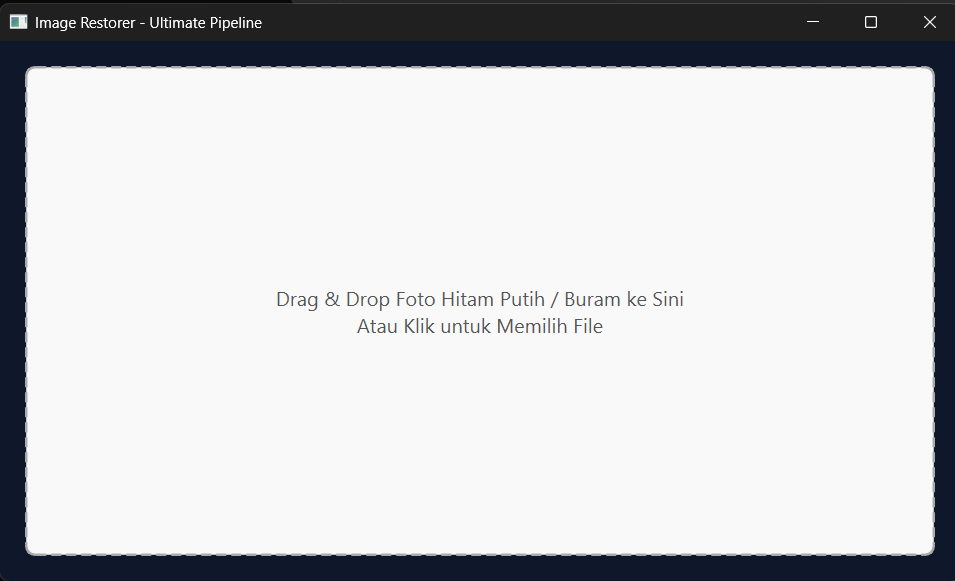
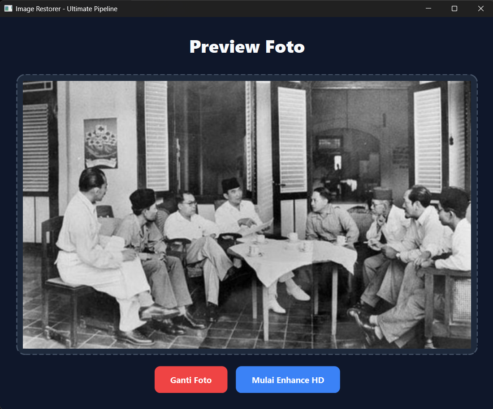
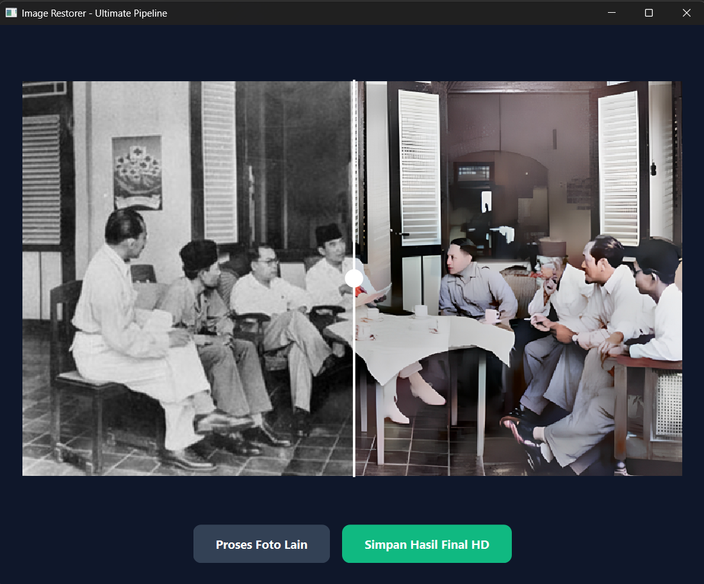

# Photo Restorer - Ultimate Pipeline


Aplikasi desktop berbasis AI yang dirancang untuk merestorasi, mewarnai, dan meningkatkan resolusi (upscale) foto lawas/rusak secara otomatis. Dibangun menggunakan arsitektur **Pemrograman Berbasis Objek (PBO)** yang mengintegrasikan tiga model *Machine Learning* State-of-the-Art ke dalam satu *pipeline* yang efisien.

Proyek ini dikembangkan untuk memenuhi tugas Ujian Tengah Semester (UTS) mata kuliah Pemrograman Berbasis Objek (PBO) di program studi Teknik Informatika, Universitas Cendekia Abditama (UCA).

---

## Fitur Utama

- **Artistic Colorization:** Mewarnai foto hitam putih dengan sangat natural menggunakan arsitektur **DeOldify**.
- **Real-World Upscaling 4x:** Memperbesar resolusi gambar dan menghaluskan tekstur pakaian serta latar belakang tanpa artefak *noise* menggunakan **SwinIR** (*Swin Transformer*).
- **HD Face Restoration:** Memperbaiki dan memperjelas detail wajah yang blur atau rusak parah menggunakan **CodeFormer**.
- **Modern UI/UX:** Antarmuka responsif bergaya *Dark Mode* (terinspirasi dari palet warna Tailwind CSS) dengan fitur *Drag & Drop* dan kanvas komparasi *Before-After Slider*.
- **Asynchronous Processing:** Menggunakan `QThread` (Multithreading) untuk mencegah GUI *freeze* selama proses *rendering* AI yang berat.
- **Memory Management & Garbage Collection:** Dilengkapi dengan sistem pembersihan VRAM GPU otomatis (`torch.cuda.empty_cache()`) dan penghapusan *file temporary* yang mencegah terjadinya *storage leak* saat aplikasi ditutup.

---

## Preview Aplikasi



*Tampilan antarmuka dengan fitur Drag n Drop File*



*Tampilan antarmuka dengan fitur Preview*



*Tampilan antarmuka dengan fitur komparasi Before-After*

---

## Cara Instalasi & Menjalankan (One-Click Setup)

Proyek ini sudah dilengkapi dengan *script* instalasi otomatis untuk pengguna OS Windows. Anda tidak perlu mengunduh model AI secara manual.

1. **Clone [repositori ini](https://github.com/ysnrw/photo_restorer):**
   ```bash
   git clone https://github.com/ynsrw/photo_restorer.git
   ```

2. **Jalankan Instalasi Otomatis:**
   Cukup klik dua kali pada file **`setup_and_run.bat`** (atau jalankan lewat terminal). 
   *Script* ini akan secara otomatis:
   - Membuat lingkungan virtual (`venv`).
   - Menginstal semua pustaka dari `requirements.txt`.
   - Mengunduh *source code* repositori Model (SwinIR, CodeFormer, DeOldify).
   - Mengunduh *weights/model .pth* (Proses ini memakan waktu tergantung kecepatan internet karena ukuran file mencapai 1 GB).
   - Membuka aplikasi secara otomatis.

3. **Untuk Penggunaan Selanjutnya:**
   Cukup jalankan `setup_and_run.bat` lagi. Sistem mendeteksi bahwa instalasi sudah selesai dan akan langsung menjalankan aplikasi.

---

## Arsitektur Pipeline AI

Aplikasi ini menggunakan konsep *Wrapper Pattern* dalam PBO untuk membungkus model-model yang kompleks ke dalam modul yang mudah dikontrol. Alur kerjanya adalah sebagai berikut:

1. **Tahap 1 (Warna):** Gambar input masuk ke `DeOldifyWrapper` untuk pewarnaan basis.
2. **Tahap 2 (Tekstur & Upscale):** Hasil pewarnaan diteruskan ke `SwinIRWrapper` untuk ditingkatkan resolusinya hingga 4x lipat menggunakan metode *Pixel Shuffle Direct*. Ini memastikan tekstur badan/kain terlihat halus.
3. **Tahap 3 (Detail Wajah):** Hasil *upscale* diekstrak oleh `CodeFormerWrapper` untuk mencari koordinat wajah dan merestorasinya secara spesifik menjadi *High Definition*.

Semua ini diorkestrasi oleh kelas `AIPipelineWorker` yang berjalan di *thread* terpisah untuk menjaga stabilitas UI.

---

## Lisensi & Kredit

Proyek perangkat lunak ini dibuat oleh **Yusuf Nurwahid**. 
Model dan arsitektur yang digunakan dalam *pipeline* ini adalah milik *researcher* dan pengembang aslinya:

- **[CodeFormer](https://github.com/sczhou/CodeFormer)** oleh Shangchen Zhou dkk.
- **[SwinIR](https://github.com/JingyunLiang/SwinIR)** oleh Jingyun Liang dkk.
- **[DeOldify](https://github.com/jantic/DeOldify)** oleh Jason Antic.

Sebagian pustaka mungkin memerlukan instalasi **FFmpeg** atau *Visual Studio C++ Build Tools* di komputer Anda untuk kompilasi modul pendukung.